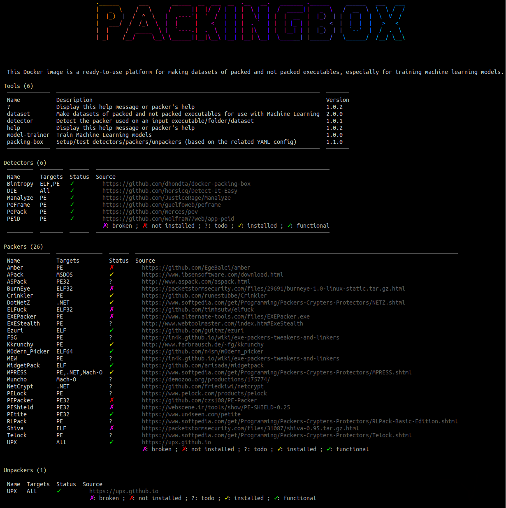

<h1 align="center">Packing Box <a href="https://twitter.com/intent/tweet?text=Packing%20Box%20-%20A%20Docker%20container%20featuring%20many%20packers,%20unpackers%20and%20detectors%20for%20studying%20executable%20packing,%20including%20machine%20learning%20dataset%20generation%20and%20algorithms.%0D%0Ahttps%3a%2f%2fgithub%2ecom%2fdhondta%2fdocker-packing-box%0D%0A&hashtags=docker,pe,elf,macho,packer,unpacker,packingdetection,peid,upx"></a></h1>
<h3 align="center">Study executable packing in a dedicated platform.</h3>

[](http://docker-packing-box.readthedocs.io/en/latest/?badge=latest)
[](https://www.gnu.org/licenses/gpl-3.0)

This Docker image aims to regroup multiple common executable packers and make datasets of packed executables.



## :fast_forward: Quick Start

```sh
$ docker build -t dhondta/packing-box .
[...]
<<<wait for a while>>>
[...]
$ docker run -it -h packing-box -v `pwd`:/mnt/share dhondta/packing-box

┌──[root@packing-box]──[/]────────                     ────[172.17.0.2]──[12:34:56]──[0.12]────
# 
```

## :bulb: TODO

- Check this [link](http://protools.narod.ru/packers.htm)
- Check this [link](https://in4k.github.io/wiki/exe-packers-tweakers-and-linkers) for new ideas
- Check this [link](https://www.softpedia.com/catList/14,1,3,0,1.html) for new ideas
- Check this [link](https://storage.ey.md/Technology%20Related/Programming%20%26%20Reversing/Tuts4You%20Collection/Unpacking%20Tutorials/)
- Check this [link](https://storage.ey.md/Technology%20Related/Programming%20%26%20Reversing/Tuts4You%20Collection/UnPackMe%20Collection/)
- Install [PoCrypt](https://github.com/picoflamingo/pocrypt)
- Install [EXE Bundle](https://www.softpedia.com/get/Security/Security-Related/EXE-Stealth-Packer.shtml) (could be the same or a further version of EXE Stealth Packer)
- Install [EXE Stealth Packer](https://www.webtoolmaster.com/packer.htm)
- Install [iPackk](http://www.pouet.net/prod.php?which=29185)
- Install [NetShrink](https://www.pelock.com/products/netshrink) ([PELock](https://www.pelock.com/) suite)
- Install [oneKpaq](http://www.pouet.net/prod.php?which=66926)
- https://github.com/fireeye/capa-rules/tree/master/anti-analysis/packer
- https://storage.ey.md/Technology%20Related/Programming%20%26%20Reversing/Tuts4You%20Collection/Unpacking%20Tutorials/
- https://reverseengineering.stackexchange.com/questions/3184/packers-protectors-for-linux
- https://reverseengineering.stackexchange.com/questions/1545/linux-protectors-any-good-one-out-there


## :clap:  Supporters

[](https://github.com/dhondta/docker-packing-box/stargazers)

[](https://github.com/dhondta/docker-packing-box/network/members)

<p align="center"><a href="#"></a></p>
