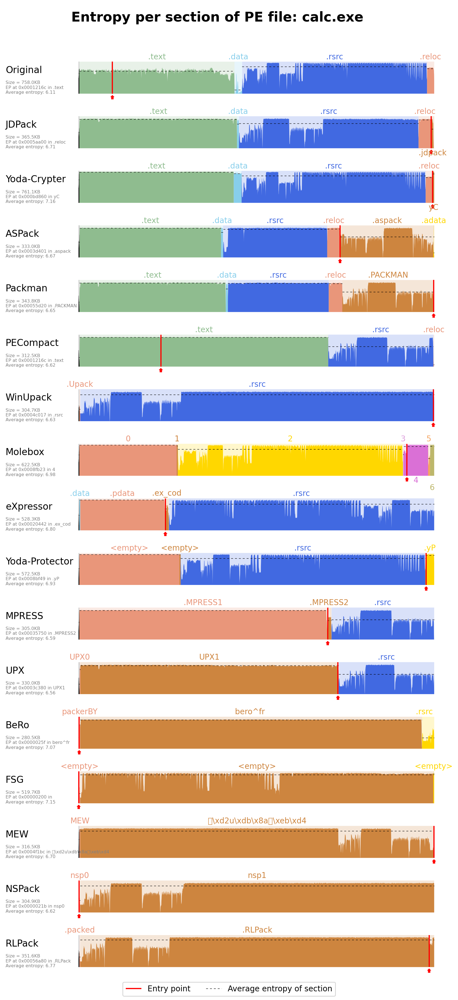
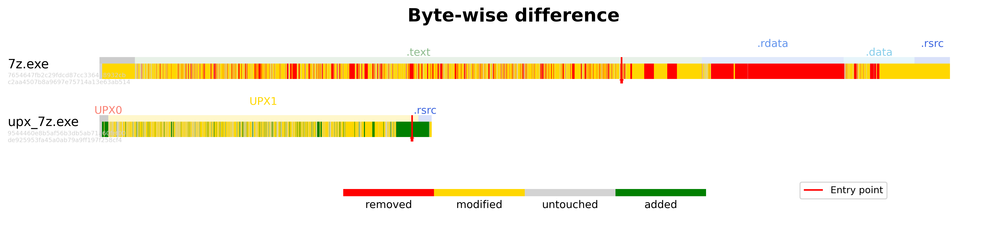

# Data Visualization

`Visualizer` is a command that allows you to visualize data in a folder/dataset. It can be used to compare, plot, find, remove and extract features from a dataset.


```console
┌──[user@packing-box]──[/mnt/share]────────
$ visualizer 
usage: visualizer [-h] [--help] [-v] CMD ...
```
 Available CMD : `compare`, `features`, `find`, `plot`, `remove`


## Plot

```console
┌──[user@packing-box]──[/mnt/share]────────
$ visualizer plot 
usage: visualizer plot [-h] [--help] [-a ALIAS] [-f {jpg,png,tif,svg}] [-l [LABEL ...]] [-m MAX_NOT_MATCHING]
[--legend-location LEGEND_LOCATION] [-n] [-s]

                       filename folder

visualizer plot: the following arguments are required: filename, folder
```

- Example ploting `calc.exe` and its packed version (if exists)
```console
┌──[user@packing-box]──[/mnt/share]────────
$ visualizer plot calc.exe dataset-packed-pe -l not-packed -l beroexepacker -l fsg -l mew -l nspack -l rlpack -s
```

This will result in a similar plot:



## Compare

`compare`, takes two binaries and compares their contents. This command helps us to see exactly what has been changed in a binary between two versions.

```console
┌──[user@packing-box]──[/mnt/share]────────
$ visualizer compare
usage: visualizer compare [-h] [--help] [-l1 LEGEND1] [-l2 LEGEND2] [-o FILE] [--text] [-t TITLE | --no-title]
                          pattern1 pattern2

visualizer compare: the following arguments are required: pattern1, pattern2
```

- Example of comparing two binaries:

```console
┌──[user@packing-box]──[/mnt/share]────────
$ visualizer compare ^7z.exe$ ^upx_7z.exe$
```

This will result in a similar plot:


If the `--text` option is used, the output will be in text format:

```console
--- /mnt/share/7z.exe

+++ /mnt/share/upx_7z.exe

@@ -33 +41 @@

-0xEE       0x2   NumberOfSections:              0x4       
+0xEE       0x2   NumberOfSections:              0x3       
@@ -47,6 +55,6 @@
SizeOfInitializedData:         0x1000    
+0x10C      0xC   SizeOfUninitializedData:       0x10000   
+0x110      0x10  AddressOfEntryPoint:           0x19920   
+0x114      0x14  BaseOfCode:                    0x11000   
+0x118      0x18  BaseOfData:                    0x1A000   
@@ -55 +63 @@

-0x124      0x24  FileAlignment:                 0x1000    
+0x124      0x24  FileAlignment:                 0x200     
@@ -63,2 +71,2 @@

-0x138      0x38  SizeOfImage:                   0x18000   
-0x13C      0x3C  SizeOfHeaders:                 0x1000    
+0x138      0x38  SizeOfImage:                   0x1B000   
+0x13C      0x3C  SizeOfHeaders:                 0x400     
@@ -79,4 +87,4 @@
<<snipped>>
```


## Features

```console
┌──[user@packing-box]──[/mnt/share]────────
$ visualizer features 
usage: visualizer features [-h] [--help] [-l [LABEL ...]] [-m MAX_NOT_MATCHING] [-r] filename folder

visualizer features: the following arguments are required: filename, folder
```


## Find

This command is used to find in a dataset files matching a given pattern, and how many variations of the file, packed by distinct packers, are found within the dataset.

```console
┌──[user@packing-box]──[/mnt/share]────────
$ visualizer find 
usage: visualizer find [-h] [--help] [-l [LABEL ...]] [-m MAX_NOT_MATCHING] [-d] [-x [EXCLUDE ...]] filename folder

visualizer find: the following arguments are required: filename, folder
```

Example of finding all the files that are not packed in a dataset:
```console  
┌──[user@packing-box]──[/mnt/share]────────
$ visualizer find . datasets/dataset-packed-elf --no-display --max-not-matching 0 

00:00:03.406 [INFO] Searching for files from datasets/dataset-packed-elf matching '.'... 

00:00:09.298 [INFO] cntraining (7/7) 
00:00:09.299 [INFO] file (7/7) 
00:00:09.299 [INFO] flock (7/7) 
00:00:09.299 [INFO] gdb (7/7) 00:00:09.300 [INFO] gsettings (7/7) 
00:00:09.300 [INFO] killall (7/7) 
00:00:09.300 [INFO] lynx (7/7) 
<<snipped>>
```

- Using the `--no-display` option will not display which packers are found for each file. Instead it will only display the number of packers found for each file. `7z.exe (1/25)` means that 1 packer was found for the file `7z.exe` out of 25 packers in the dataset.

- Using the `--max-not-matching` option will only display files that have less than the specified number of packers. `--max-not-matching 0` will only display files that are present in all packers datasets. (i.e. 25/25 packers found for the file)

Example of usage:
```console
┌──[user@packing-box]──[/mnt/share]────────
$ visualizer find . dataset-packed-pe/packed --no-display --max-not-matching 2

00:00:00.240 [INFO] Searching for files from dataset-packed-pe/packed matching '.'...
00:00:04.132 [INFO] DarkNamer.exe (23/25)
00:00:04.132 [INFO] FastHash_kr.exe (23/25)
00:00:04.133 [INFO] Hash.exe (23/25)
00:00:04.133 [INFO] LoadOrd.exe (23/25)
00:00:04.133 [INFO] LoadOrdC.exe (23/25)
00:00:04.133 [INFO] OpenedFilesView.exe (24/25)
<<snipped>>
```


## Remove

```console
┌──[user@packing-box]──[/mnt/share]────────
$ visualizer remove 
usage: visualizer remove [-h] [--help] [-l [LABEL ...]] [-m MAX_NOT_MATCHING] filename folder

visualizer remove: the following arguments are required: filename, folder
```

